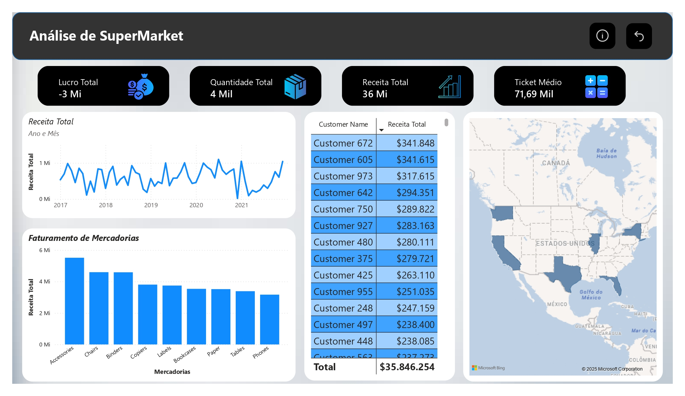

# 📊 Dashboard Supermarket - Power BI

<p align="center">
  
</p>

## 📑 Descrição

Este projeto consiste em um dashboard desenvolvido no Power BI com dados fictícios de vendas de um supermercado. O objetivo é analisar o desempenho de vendas, ticket médio, receita, lucro, quantidade de vendas e também avaliar os principais clientes e a distribuição geográfica.

## 🔧 Ferramentas Utilizadas

- Power BI
- Microsoft Excel (para tratamento dos dados)
- SQL (para análise e manipulação dos dados)

## 🗂️ Dataset

- **Nome:** Superstore_REAL_sample_500.csv
- Dataset amostral com informações de:
  - ID do pedido
  - Data do pedido
  - Nome do cliente
  - Segmento
  - Estado e Região
  - Categoria e Subcategoria
  - Quantidade
  - Receita
  - Desconto
  - Lucro

## 📈 Visões Disponíveis no Dashboard

- ✅ Receita total por mês (gráfico de linhas empilhadas)
- ✅ Faturamento por mercadoria (gráfico de colunas empilhadas)
- ✅ Top 13 clientes com maior receita (tabela dinâmica)
- ✅ Mapa geográfico de vendas por estado
- ✅ Indicadores principais (KPI):
  - Receita Total
  - Lucro Total
  - Quantidade Total
  - Ticket Médio

## 📷 Imagem do Dashboard

<p align="center">
  
</p>

## 🚀 Como Executar o Projeto

1. Clone este repositório:
```bash
git clone https://github.com/seu-usuario/Dashboard-Supermarket-PowerBI.git
```

2. Abra o arquivo `Dashboard SuperMarket.pbix` no Power BI Desktop.

3. Explore e interaja com os dados!

## ⚠️ Observações

- O arquivo `.pbix` é o projeto do Power BI.
- O arquivo `.csv` é a base de dados utilizada.
- Este dashboard não está disponível de forma interativa na web devido às limitações do Power BI gratuito, que exige conta corporativa para publicação online.

## 🧠 Aprendizados

- Desenvolvimento de dashboards interativos no Power BI.
- Análise de dados de vendas.
- Criação de KPIs e visualizações dinâmicas.
- Manipulação e limpeza de dados utilizando Excel e SQL.

## 🤝 Contribuição

Sinta-se à vontade para abrir Issues e Pull Requests com sugestões ou melhorias.
